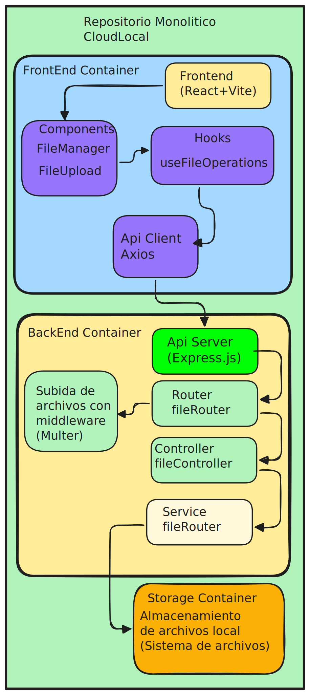

# CloudLocal

## Descripción
**CloudLocal** es un sistema de gestión de archivos que permite a los usuarios subir, descargar y gestionar archivos de manera sencilla, simula ser un almacenamiento en la nube, pero de manera local, usando un ordenador que ya no se esté utilizando en casa o en el trabajo. Con este sistema, puedes tener tu propia "nube personal" sin necesidad de depender de servicios de terceros.

## Estructura del Proyecto
- **Frontend**: React + Vite
  - Componentes: `FileManager`, `FileUpload`
  - Hooks: `useFileOperations`
- **Backend**: Express.js
  - Rutas: `fileRouter`
  - Controladores: `fileController`
  - Servicios: `fileService`

## Diagrama de Estructura

A continuación se muestra un diagrama que muestra la estructura del proyecto:



## Tecnologías y Librerías Usadas
- **Frontend**:
  - React
  - Vite
  - Tailwind CSS
  - Framer Motion
  - Axios
- **Backend**:
  - Express.js
  - CORS
  - Multer

## Requisitos Previos
- [Bun](https://bun.sh/) (v0.1 o superior)

## Inicialización del Proyecto

### Clonar el Repositorio
```bash
git clone https://github.com/AlexisVarela2811/CloudLocal.git
cd CloudLocal
```

### Ejecucion del proyecto

1. Instala las dependencias:
   ```bash
   bun install
   ```   
2. Crea un archivo `.env` en la carpeta del servidor y configura las variables necesarias:

```plaintext
# Configuración del servidor
PORT=5000                           # Puerto del servidor
HOST=0.0.0.0                        # Dirección IP del servidor

# Orígenes permitidos para CORS
ORIGINS=http://localhost:5173,http://ipejemplo:5173,http://ipejemplo:5173
```
3. Asegúrate de que tu archivo `vite.config.ts` esté configurado correctamente. Aquí tienes un ejemplo de configuración:

```typescript
import { defineConfig } from 'vite'
import react from '@vitejs/plugin-react'

// https://vite.dev/config/
export default defineConfig({
  plugins: [react()],
  server: {
    host: '0.0.0.0',
    port: 5173
  },
})
```
4. Ejecuta el proyecto:
   ```bash
   bun start
   ``` 

## Pruebas Locales
Una vez que ambos servidores (frontend y backend) estén en funcionamiento, puedes acceder a la aplicación en tu navegador en la dirección [http://localhost:5173](http://localhost:5173) o en el puerto que hayas configurado en el archivo `.env` y en el `vite.config.ts` ademas verificar que `api.ts` este apuntado al backend .

## Contribuciones
Las contribuciones son bienvenidas. Por favor, abre un issue o un pull request.
